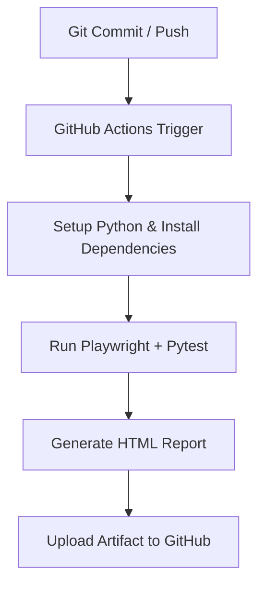

# 🔗 Playwright + MCP Integration

This repository demonstrates how to connect **Playwright-based Python UI tests** to **MCP (Model Context Protocol)** for intelligent testing flows.

## Features
- ✅ Browser automation with Playwright
- 🤖 AI-aware testing using MCP SDK
- 🧩 Configurable YAML for connecting to custom MCP servers
- 💡 Extendable design for adaptive and self-healing test logic

*NOTE: pom.xml is for local-use only*

### Legacy Java Artifacts (pom.xml)
This project is primarily a **Python / Playwright / MCP** framework. The file `pom.xml` was retained for local reference/legacy compatibility, but **is not committed** to this repository.  
To keep it locally without committing:
1. Add `pom.xml` to `.gitignore` (already included).  
2. If `pom.xml` was previously tracked, run:
   ```bash
   git rm --cached pom.xml
   git commit -m "Remove pom.xml from Git and ignore it"


---

## ⚙️ Environment Setup

### 🪟 Local (Windows)
1. **Create and activate virtual environment**
   ```bash
   python -m venv .venv
   .\.venv\Scripts\Activate.ps1

2. **Install dependencies**
   ```bash
   python -m pip install --upgrade pip
   python -m pip install -r requirements.txt
   playwright install

3. **Run tests manually**
   ```bash
   pytest -v --maxfail=1 --disable-warnings --html=report.html --self-contained-html

### Optional: Run manual test flow
Instead of `pytest`, you can execute the main integration manually:
   ```bash
   python main.py
   ```
*This runs the MCP + Playwright flow directly and prints progress to the console.*

## GitHub Actions (Ubuntu CI)
This project includes a cross-platform GitHub Actions workflow at:
   ```bash
.github/workflows/python-ci.yml
```
## 💡Highlights:

1. Auto-runs on push and pull_request to main

2. Sets up Python 3.11 and caches dependencies

3. Creates a virtual environment automatically

4. Runs Playwright tests and uploads the HTML test report as an artifact

5. Compatible with both Linux (CI) and Windows (local)

## 🤖 MCP Server Integration

The framework uses the following environment variable:
   ```bash
MCP_SERVER_URL=wss://mcp.openai.com/v1
```
 *This enables bidirectional WebSocket communication with the MCP server for AI-assisted actions and validations.*

## 🧪 Test Execution Flow



## 📊 HTML Report

After each CI run:

1. Report artifact name: pytest-report

2. Accessible in the Actions tab → Artifacts section

3. Local report: report.html created in project root


## 🚀 Future Enhancements

* Matrix build for Ubuntu + Windows

*  CodeQL security scan workflow

*  AI-based test case suggestion integration via MCP

*  Playwright parallel execution configuration

*  Automatic GitHub Pages publishing of HTML report

## 💡Summary

This framework demonstrates:

* Seamless Playwright + MCP integration

* Unified test setup for both local and CI environments

* Intelligent, maintainable, and extensible Python automation architecture